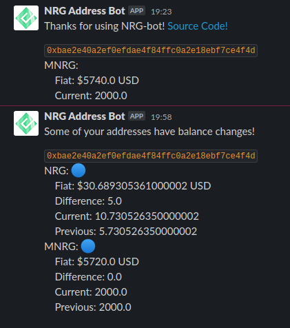

# NRG Slack Bot
A slack custom integration using a heroku scheduler to update slack channel when an address(s) have balance changes.

## Requirements:
- Heroku account
- Firebase account
- Heroku CLI
- git 
- Slack workspace with admin privilege

## Getting Started
- Create a slack custom integration if you have not already
- `git clone git@github.com:zahin-mohammad/nrg-slack-app.git`
- `cd nrg-slack-app`
- Create a heroku project (skip if its already set up)
  - `heroku login`
  - `heroku create`
  - `heroku push origin master`
- Setup Environment Variables:
  - These can also be configured on the web client for heroku
  - `heroku config:set webhook="{slack incoming web hook}"`
  - `heroku config:set addressList="{space separated list of addresses"`
- Install the scheduler via the CLI
  - `heroku addons:create scheduler:standard` 
- Configure the scheduler 
  - `heroku addons:open scheduler`
  - `python3 ./bin/nrg-address-summary.py` run command
  - configure frequency as desired
- Setup Firebase
  - Create a firebase project at `https://firebase.google.com/`
  - Create a database
  - Download a private key from `settings -> Service Accounts`
  - Rename this file to `firestore-admin.json`
- Add Firebase Admin Cred to Heroku
  - On the web heroku client, paste in the contents of `firestore-admin.json` into a config var (environment variable) called `firestoreAdmin`
- Verify that the script works
  - `heroku run python3 ./bin/nrg-address-bot.py`
  - Should see a slack message
